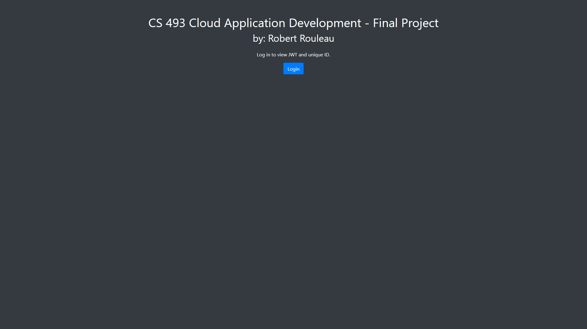
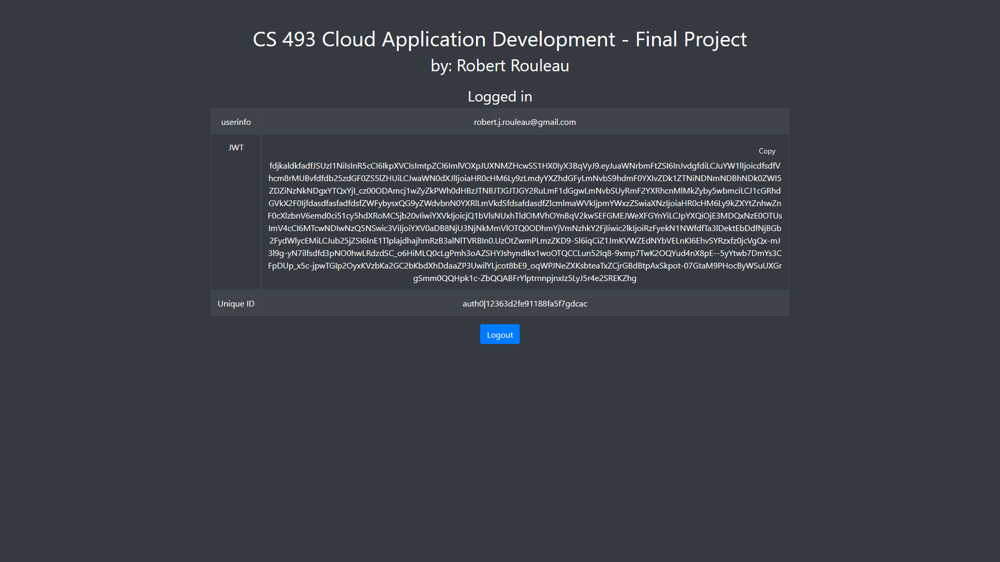

# gcloud-rest-app

[API Specification](gcloud-rest-app.pdf)

### Change Log

- **Version 1.0 (Dec 11, 2023):** Initial version.

---

### Project Overview

This repository contains the final project for CS 493: Cloud Application Development. It includes a data model and API specification for a music playlist management system. It also contains a comprehensive Postman test suite. The application is no longer being hosted.

#### Screenshot of the Home Page

#### Screenshot of the User Page

---

### Data Model

The application stores three kinds of entities in Datastore: Users, Playlists, and Songs. There's a one-to-many relationship between Users and Playlists, and Playlists have a many-to-many relationship with Songs.

#### Users

- **id (Integer):** Auto-generated by Datastore.
- **owner (String):** Unique ID, value of “sub” in JWT upon User creation.

#### Playlists

- **id (Integer):** Auto-generated. 
- **name (String):** Unique within owner's playlists, max 100 chars.
- **description (String):** Brief description, max 300 chars.
- **owner (String):** Unique ID from JWT.
- **song_count (Integer):** Total number of songs.
- **songs (JSON):** Contains song ID, name, and URL.

#### Songs

- **id (Integer):** Auto-generated.
- **title (String):** Song title, max 50 chars.
- **artist (String):** Artist's name, max 50 chars.
- **album (String):** Album name, can be empty.

---

### API Specification

The API supports various operations for Users, Playlists, and Songs. Below is a brief overview of available endpoints:

#### Account Creation and Login
- **Integrated with Auth0**

#### Users
- **View all Users:** `GET /users`

#### Playlists
- **Create, View, Edit, Delete, and Manage Songs in Playlists:** Various endpoints like `POST /playlists`, `GET /playlist/:playlist_id`, etc.

#### Songs
- **Create, View, Edit, and Delete Songs:** Endpoints like `POST /songs`, `GET /songs/:song_id`, etc.

_Refer to the detailed API documentation in this repository for more information on request and response formats, including examples._

---

### Using the API

To use the API, you must set the Authorization header to Bearer Token with a valid JWT. This token can be obtained by logging in or creating a new account at the project URL.

---

### Contact

[Robert Rouleau] - [robert.j.rouleau@gmail.com]

---
